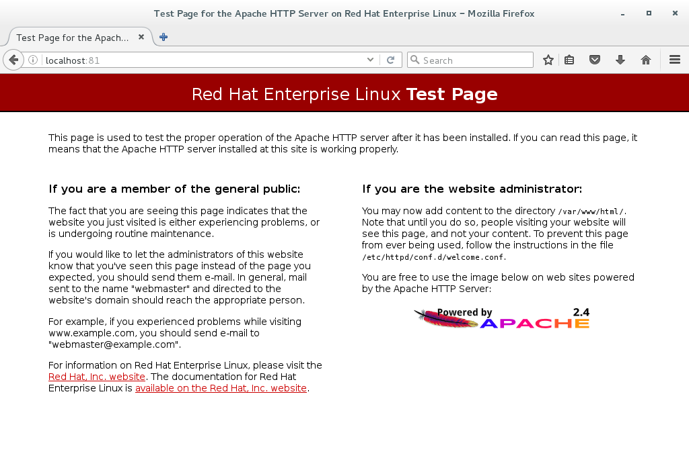

== Lab 1 - Docker Refresh (optional)

image:images/logo_docker.png[images/logo_docker.png]

In this lab we will explore the docker environment within Red Hat OpenShift Container Platform. If you are familiar with docker this may function as a brief refresher or proceed with Lab 2. If you are new to docker this will serve as an introduction to docker basics. Don't worry, we will progress rapidly. To get through this lab, we are going to focus on the environment itself as well as walk through some exercises with a couple of Docker images / containers to tell a complete story and point out some things that you might have to consider when containerizing your application.

This lab should be performed on *the machine in front* of you unless otherwise instructed.

The machine should have been brought up in lab. 
You can access that machine using username _student_ and password _student_

Expected completion: 15 minutes

Topics:

* Review Docker and systemd
* Review Docker help
* Explore a Dockerfile
* Build an image
* Launch a container
* Inspect a container

=== Docker and systemd
Check out the systemd unit file that starts Docker on Red Hat OpenShift Container Platform and notice that it includes 3 Environment Files. These files tell Docker how the Docker daemon, storage and networking should be set up and configured. Take a look at those files too. Specifically, in the /etc/sysconfig/docker file check out the registry settings. You may find it interesting that you can ADD_REGISTRY and BLOCK_REGISTRY. Think about the different use cases for that.

Perform the following commands as root unless instructed otherwise.

[source,bash]
----
[student@localhost ~]$ cat /usr/lib/systemd/system/docker.service
[student@localhost ~]$ cat /usr/lib/systemd/system/docker-storage-setup.service
[student@localhost ~]$ cat /etc/sysconfig/docker
[student@localhost ~]$ cat /etc/sysconfig/docker-storage
[student@localhost ~]$ cat /etc/sysconfig/docker-network
----

Now check the status of docker and make sure it is running before moving forward.
It should have been brought up automatically for us by the OCP environment.

[source,bash]
----
[student@localhost ~]$ sudo systemctl status docker
docker.service - Docker Application Container Engine
   Loaded: loaded (/usr/lib/systemd/system/docker.service; enabled; vendor preset: disabled)
   Active: active (running) since Wed 2017-04-12 04:00:12 EDT; 49min ago
 	Docs: http://docs.docker.com
 Main PID: 1155 (dockerd-current)
   Memory: 53.1M
   CGroup: /system.slice/docker.service
       	├─ 1155 /usr/bin/dockerd-current --add-runtime docker-runc=/usr/li...
       	├─ 1208 /usr/bin/docker-containerd-current -l unix:///var/run/dock...
       	├─12583 /usr/bin/docker-containerd-shim-current 333a60f20aa4656a83...
       	├─12872 /usr/bin/docker-containerd-shim-current 7db3ba876d6b184019...
       	├─12932 /usr/bin/docker-containerd-shim-current 04672958b1e3c86d47...
       	├─13043 /usr/bin/docker-containerd-shim-current 5e1c65898c640522f6...
       	└─13109 /usr/bin/docker-containerd-shim-current ee864ca54c2c2e7d9d...

Apr 12 04:46:12 localhost.localdomain dockerd-current[1155]: time="2017-04-12...
Apr 12 04:46:12 localhost.localdomain dockerd-current[1155]: time="2017-04-12...
Apr 12 04:46:12 localhost.localdomain dockerd-current[1155]: time="2017-04-12...
Apr 12 04:46:15 localhost.localdomain dockerd-current[1155]: time="2017-04-12...
Apr 12 04:46:16 localhost.localdomain dockerd-current[1155]: time="2017-04-12...
Apr 12 04:46:16 localhost.localdomain dockerd-current[1155]: time="2017-04-12...
Apr 12 04:46:18 localhost.localdomain dockerd-current[1155]: time="2017-04-12...
Apr 12 04:46:18 localhost.localdomain dockerd-current[1155]: time="2017-04-12...
Apr 12 04:46:19 localhost.localdomain dockerd-current[1155]: time="2017-04-12...
Apr 12 04:46:20 localhost.localdomain dockerd-current[1155]: time="2017-04-12...
Hint: Some lines were ellipsized, use -l to show in full.
----

=== Docker Help
Now that we see how the Docker startup process works, we should make sure we know how to get help when we need it.  Run the following commands to get familiar with what is included in the Docker package as well as what is provided in the man pages. Spend some time exploring here. When you run docker info check out the storage configuration. The CDK automatically sets up storage for us by creating an LVM thin pool for use as a device mapper direct docker storage backend.

Check out the executables provided:

[source,bash]
----
[student@localhost ~]$ rpm -ql docker | grep bin
/usr/bin/docker-containerd-current
/usr/bin/docker-containerd-shim-current
/usr/bin/docker-ctr-current
/usr/bin/docker-storage-setup
/usr/bin/dockerd-current
----

Check out the configuration files that are provided:

[source,bash]
----
[student@localhost ~]$ rpm -qc docker
/etc/sysconfig/docker-network
/etc/sysconfig/docker-storage
/etc/sysconfig/docker-storage-setup
----

Check out the documentation that is provided:

[source,bash]
----
[student@localhost ~]$ rpm -qd docker
/usr/share/doc/docker-1.12.6/AUTHORS
/usr/share/doc/docker-1.12.6/CHANGELOG.md

[student@localhost ~]$ docker --help
Usage: docker [OPTIONS] COMMAND [arg...]
   	docker [ --help | -v | --version ]
A self-sufficient runtime for containers……
[student@localhost ~]$ docker info
Containers: 6
 Running: 5
 Paused: 0
 Stopped: 1
Images: 20
Server Version: 1.12.6

OSType: linux
Architecture: x86_64
Number of Docker Hooks: 2
CPUs: 2
Total Memory: 11.3 GiB
Name: localhost.localdomain
ID: LCWG:G2DM:GTYE:XQXP:TGFH:KEZA:BAXC:YASG:3PJ2:AJ4D:QSLD:OOUM
Docker Root Dir: /var/lib/docker
Debug Mode (client): false
Debug Mode (server): false
Registry: https://registry.access.redhat.com/v1/
Insecure Registries:
 172.30.0.0/16
 127.0.0.0/8
Registries: registry.access.redhat.com (secure), docker.io (secure)
----

Take a look at the Docker images on the system. You should see some Openshift images that are cached in the OCP environment so you can build the containers without having to wait for the container images to download from the internet.
 
[source,bash]
----
[student@localhost ~]$ docker images
REPOSITORY                                                               	TAG             	IMAGE ID        	CREATED         	SIZE
registry.access.redhat.com/openshift3/ose-sti-builder                    	v3.4.1.12       	06af71a951dd    	13 days ago     	726.6 MB
registry.access.redhat.com/openshift3/ose-haproxy-router                 	v3.4.1.12       	0e5da1bc1bd6    	13 days ago     	745.3 MB
registry.access.redhat.com/openshift3/ose-deployer                       	v3.4.1.12       	77323ab89f5c    	13 days ago     	726.6 MB
registry.access.redhat.com/openshift3/ose-docker-registry                	v3.4.1.12       	08aaa1c313ef    	13 days ago     	806.5 MB
registry.access.redhat.com/openshift3/ose                                	v3.4.1.12       	14a5d3344278    	13 days ago     	726.6 MB
registry.access.redhat.com/openshift3/ose-pod                            	v3.4.1.12       	310eda5cf7fd    	13 days ago     	205 MB
registry.access.redhat.com/jboss-eap-7/eap70-openshift                   	latest          	f6ca7f01844e    	3 weeks ago     	1.042 GB
registry.access.redhat.com/jboss-datavirt-6/datavirt63-openshift         	latest          	837aa4172c2c    	4 weeks ago     	972.6 MB
----

=== Lets explore a Dockerfile

As a part of the Red Hat Software Collections offering, Red Hat provides a number of container images, which are based on the corresponding Software Collections. These include application, daemon, and database images. Here you can see in the FROM command that we are pulling a Apache Web Server base image based on RHEL 7.3 that we are going to use in this example. Containers that are being built inherit the subscriptions of the host they are running on, so you only need to register the host system. Here we are just going to explore a simple Dockerfile. The purpose for this is to have a look at some of the basic commands that are used to construct a Docker image. For this lab, we will explore a basic Apache Dockerfile and then confirm functionality.

As the student user, change directory to ~/summit-2017-dataservices/labs/lab1/ and cat out the Dockerfile

[source,bash]
----
[student@localhost ~]$ cd ~/summit-2017-dataservices/labs/lab1
[student@localhost lab1]$ cat Dockerfile
# Pull the rhel image from the local repository
FROM registry.access.redhat.com/rhscl/httpd-24-rhel7
MAINTAINER Student <student@foo.io>

USER root

EXPOSE 80
----

After gaining access to a repository, we EXPOSE port 80, which allows traffic into the container, and then set the container to start.  

=== Build an Image

Now that we have taken a look at the Dockerfile, lets build this image. Since it was already built previously the image is retrieved from the cache.

[source,bash]
----
[student@localhost lab1]$ docker build -t redhat/apache .
Sending build context to Docker daemon 2.048 kB
Step 1 : FROM registry.access.redhat.com/rhscl/httpd-24-rhel7
 ---> 533e496998ca
Step 2 : MAINTAINER Student <student@foo.io>
 ---> Using cache
 ---> 2421ced729fb
Step 3 : USER root
 ---> Using cache
 ---> 0fd493ddbb4a
Step 4 : EXPOSE 80
 ---> Using cache
 ---> 3ce031e2bbc5
Successfully built 3ce031e2bbc5
----

=== Run the Container

Next, lets run the image and make sure it started.

[source,bash]
----
[student@localhost lab1]$ docker run -dt -p 81:80 --name apache redhat/apache
e9e06e014a73c7250f3c3c23d8be902fbf47db2e110d4d531c8fcadaa51a771c

[student@localhost lab1]$ docker ps
CONTAINER ID    	IMAGE                                                             	COMMAND              	CREATED         	STATUS          	PORTS                                         	NAMES
e9e06e014a73    	redhat/apache                                                     	"/usr/local/bin/run-h"   21 seconds ago  	Up 18 seconds   	443/tcp, 8080/tcp, 8443/tcp, 0.0.0.0:81->80/tcp   apache
ee864ca54c2c    	registry.access.redhat.com/openshift3/ose-docker-registry:v3.4.1.12 "/bin/sh -c DOCKER_R"   19 minutes ago  	Up 19 minutes                                                     	k8s_registry.8a800f10_docker-registry-1-j6jhx_default_49d05df7-1ef3-11e7-90e8-5254006bc4cb_65305227
5e1c65898c64    	registry.access.redhat.com/openshift3/ose-haproxy-router:v3.4.1.12	"/usr/bin/openshift-r"   19 minutes ago  	Up 19 minutes                                                     	k8s_router.6a91aafa_router-1-qcf69_default_49df9473-1ef3-11e7-90e8-5254006bc4cb_d29bf1f4
04672958b1e3    	registry.access.redhat.com/openshift3/ose-pod:v3.4.1.12           	"/pod"               	19 minutes ago  	Up 19 minutes                                                     	k8s_POD.b6fc0873_docker-registry-1-j6jhx_default_49d05df7-1ef3-11e7-90e8-5254006bc4cb_f5a20da2
7db3ba876d6b    	registry.access.redhat.com/openshift3/ose-pod:v3.4.1.12           	"/pod"               	19 minutes ago  	Up 19 minutes                                                     	k8s_POD.8f3ae681_router-1-qcf69_default_49df9473-1ef3-11e7-90e8-5254006bc4cb_7697cd22
333a60f20aa4    	registry.access.redhat.com/openshift3/ose:v3.4.1.12               	"/usr/bin/openshift s"   20 minutes ago  	Up 20 minutes	
----

Here we are using a few switches to configure the running container the way we want it. We are running a -dt to run in detached mode with a pseudo TTY. Next we are mapping a port from the host to the container. We are being explicit here. We have told  Docker to map port 81 on the host to port 80 in the container. Now, we could have let Docker handle the host side port mapping dynamically by passing a -P or -p 80, in which case Docker would have randomly assigned a port to the container. Finally, we passed in the name of the image that we built earlier.

Okay, lets make sure we can access the web server.

[source,bash]
----
[student@localhost lab1]$ curl http://localhost:81
<!DOCTYPE html PUBLIC \"-//W3C//DTD XHTML 1.1//EN\" \"http://www.w3.org/TR/xhtml11/DTD/xhtml11.dtd\">

<html xmlns=\"http://www.w3.org/1999/xhtml\" xml:lang=\"en\">
	<head>
		<title>Test Page for the Apache HTTP Server on Red Hat Enterprise Linux</title>
.....
----

Start Firefox Web Browser using Applications→Favorites→Firefox Web Browser and point the URL to http://localhost:81 and should see a similar screen as depicted below

Now that we have built an image, launched a container and confirmed that it is running, let\'s do some further inspection of the container. We should take a look at the container IP address. Let\'s use docker inspect to do that.

=== Time to Inspect

[source,bash]
----
[student@localhost lab1]$ docker inspect apache
----

We can see that this gives us quite a bit of information in json format. We can scroll around and find the IP address, it will be towards the bottom.

[source,bash]
----
	"Networks": {
            	"bridge": {
                	"IPAMConfig": null,
                	"Links": null,
                	"Aliases": null,
                	"NetworkID": "4c6c77ea7038a36ca39f11d4cfb80cb0e502d975f87d33ba47bccccd0c6c168d",
                	"EndpointID": "251efeefa42411516842d8d4ca230759d8a63ef6c670a15bc4f4e0ef3faa95ce",
                	"Gateway": "172.17.0.1",
                	"IPAddress": "172.17.0.3",
                	"IPPrefixLen": 16,
                	"IPv6Gateway": "",
                	"GlobalIPv6Address": "",
                	"GlobalIPv6PrefixLen": 0,
                	"MacAddress": "02:42:ac:11:00:03"
            	}
        	}
----

Let\'s be more explicit with our docker inspect

[source,bash]
----
[student@localhost lab1]$ docker inspect --format '\{\{ .NetworkSettings.IPAddress \}\}' apache
172.17.0.3
----

You should see the IP address that was assigned to the container. 

We can apply the same filter to any value in the json output. Try a few different ones.

Now lets look inside the container and see what that environment looks like. We first need to get the PID of the container so we can attach to the PID namespace with nsenter. After we have the PID, go ahead and enter the namespaces of the container substituting the PID on your container for the one listed below. Take a look at the man page to understand all the flags we are passing to nsenter.

[source,bash]
----
[student@localhost lab1]$ docker inspect --format '\{\{ .State.Pid \}\}' apache
15860

[student@localhost lab1]$ man nsenter
NAME
   	nsenter - run program with namespaces of other processes
…...

[student@localhost lab1]$ sudo nsenter -m -u -n -i -p -t 15860
[sudo] password for student:
[root@e9e06e014a73 /]#
----

Now run some commands and explore the environment. Remember, we are in a slimmed down container at this point - this is by design. You may find yourself restricted.

[source,bash]
----
[root@e9e06e014a73 /]# ps aux
USER   	PID %CPU %MEM	VSZ   RSS TTY  	STAT START   TIME COMMAND
root     	1  0.0  0.0 258144  7508 ?    	Ss+  09:05   0:00 httpd -DFOREGROUND
apache  	20  0.0  0.0 266472  4712 ?    	Sl+  09:05   0:00 httpd -DFOREGROUND
apache  	21  0.0  0.0 266472  4196 ?    	Sl+  09:05   0:00 httpd -DFOREGROUND
apache  	22  0.0  0.0 266472  4200 ?    	Sl+  09:05   0:00 httpd -DFOREGROUND
apache  	23  0.0  0.0 266472  4712 ?    	Sl+  09:05   0:00 httpd -DFOREGROUND
apache  	26  0.0  0.0 266472  4196 ?    	Sl+  09:05   0:00 httpd -DFOREGROUND
apache  	30  0.0  0.0 266472  4196 ?    	Sl+  09:10   0:00 httpd -DFOREGROUND
root    	32  0.0  0.0  13368  2020 ?    	S	09:18   0:00 -bash
root    	46  0.0  0.0  49040  1836 ?    	R+   09:18   0:00 ps aux

[root@e9e06e014a73 /]# ls /bin
[                 	findmnt            	msgconv          	sim_client
a2p               	find-repos-of-install  msgen            	size
aclocal           	fipscheck          	msgexec          	skill

[root@e9e06e014a73 /]# cat /etc/hosts
127.0.0.1    localhost
::1    localhost ip6-localhost ip6-loopback
fe00::0    ip6-localnet
ff00::0    ip6-mcastprefix
ff02::1    ip6-allnodes
ff02::2    ip6-allrouters
172.17.0.3    e9e06e014a73

[root@e9e06e014a73 /]# ip addr
-bash: ip: command not found
----

Well, what can we do?  You can install software into this container.

[source,bash]
----
[root@e9e06e014a73 /]# yum -y install iproute
[root@e9e06e014a73 /]# ip addr
1: lo: <LOOPBACK,UP,LOWER_UP> mtu 65536 qdisc noqueue state UNKNOWN qlen 1
	link/loopback 00:00:00:00:00:00 brd 00:00:00:00:00:00
	inet 127.0.0.1/8 scope host lo
   	valid_lft forever preferred_lft forever
	inet6 ::1/128 scope host
   	valid_lft forever preferred_lft forever
16: eth0@if17: <BROADCAST,MULTICAST,UP,LOWER_UP> mtu 1500 qdisc noqueue state UP
	link/ether 02:42:ac:11:00:03 brd ff:ff:ff:ff:ff:ff link-netnsid 0
	inet 172.17.0.3/16 scope global eth0
   	valid_lft forever preferred_lft forever
	inet6 fe80::42:acff:fe11:3/64 scope link
   	valid_lft forever preferred_lft forever
----

Exit the container namespace with CTRL+d or exit.

In addition to using nsenter to enter the namespace of your container, you can also execute commands in that namespace with docker exec.

[source,bash]
----
$ docker exec <container-name OR container-id> <cmd>
[student@localhost lab1]$ docker exec apache pwd
/opt/app-root/src
----

Whew, so we do have some options. Now, remember that this lab is all about containerizing your existing apps. You will need some of the tools listed above to go through the process of containerizing your apps. Troubleshooting problems when you are in a container is going to be something that you get very familiar with.

Before we move on to the next section let\'s clean up the apache container so we don\'t have it hanging around.

[source,bash]
----
[student@localhost lab1]$ docker rm -f apache
Apache
[student@localhost lab1]$ cd $HOME
[student@localhost ~]$
----

==== Congratulations!!!!! You have completed this lab.