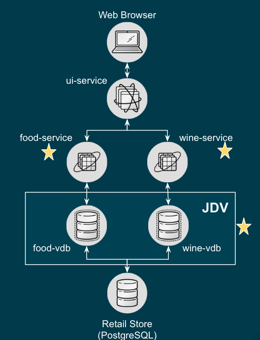
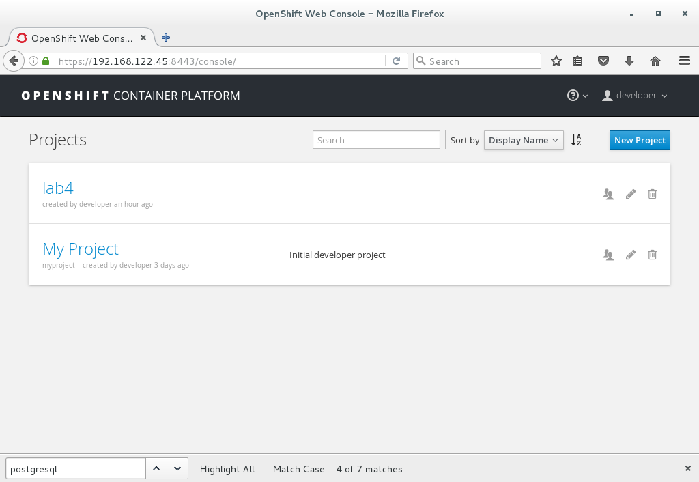
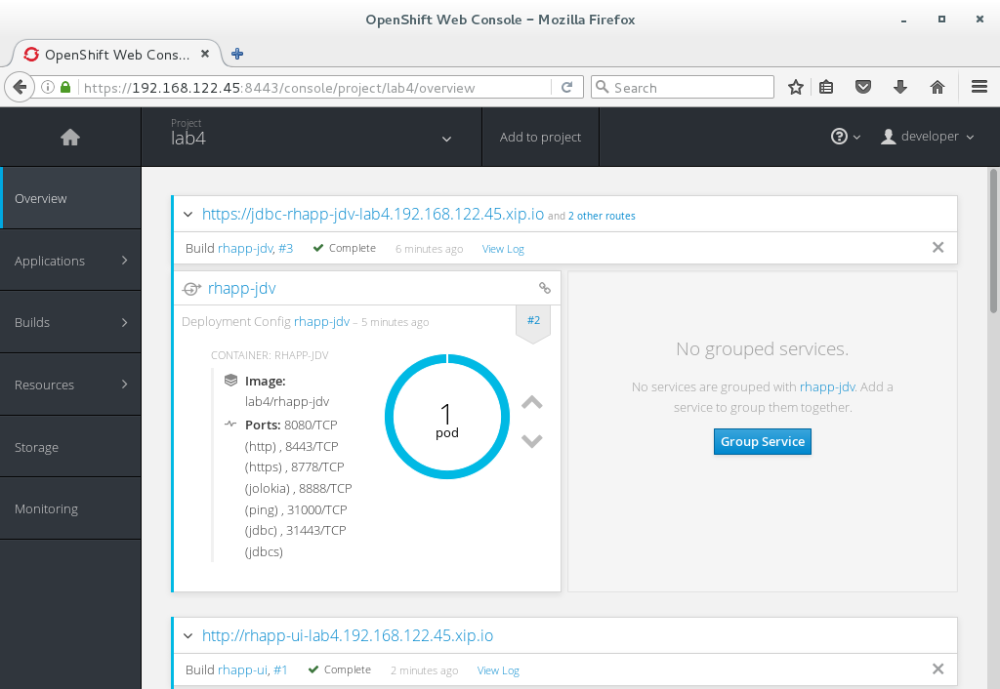
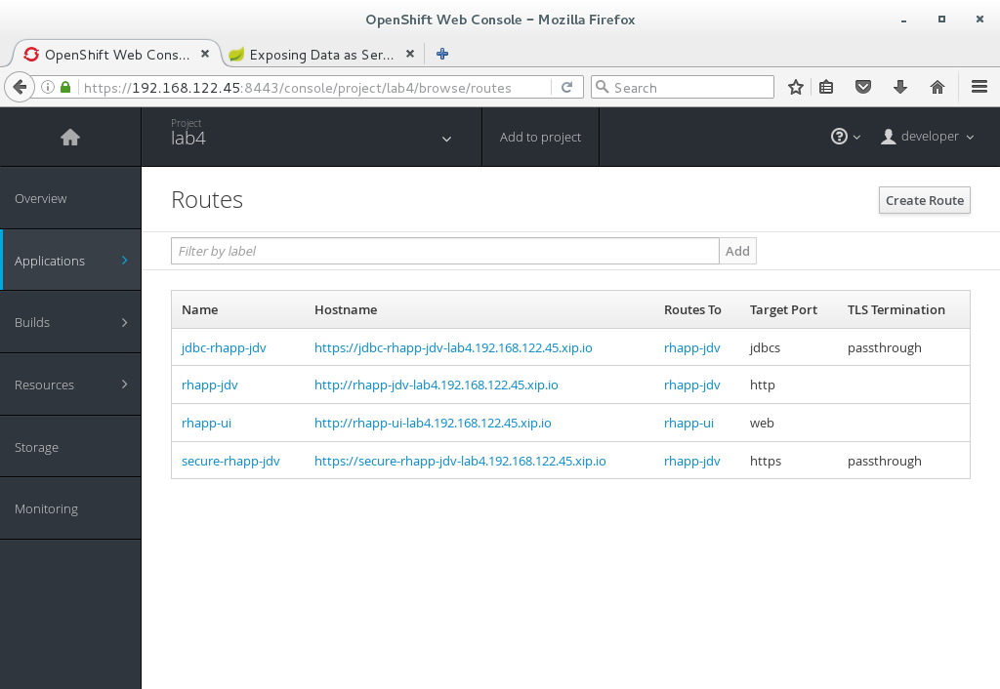
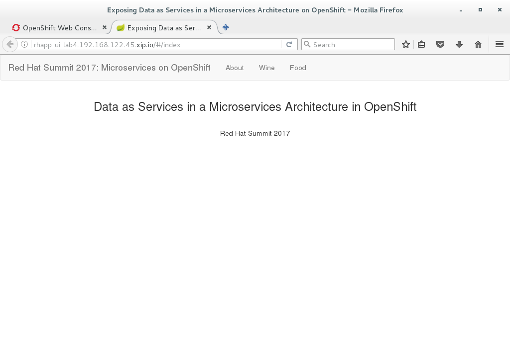
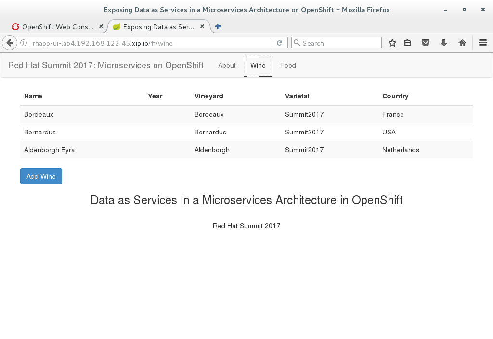
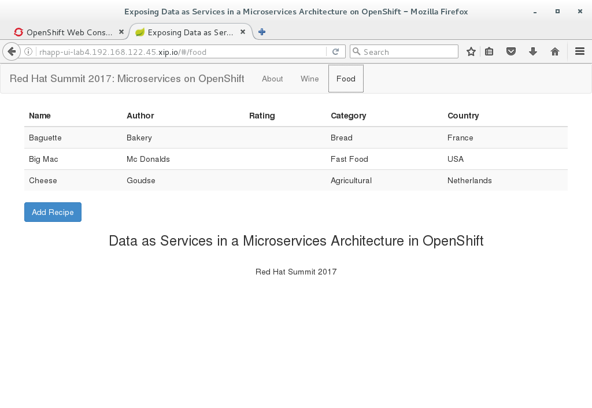

== Lab 4 - Changing the microservices application using data services
In this lab you will change the microservices application to use data services provided by Red Hat JBoss Data Virtualization. In this process we explore the changes we need to make in order to utilize the capabilities of Red Hat JBoss Data Virtualization.

This lab should be performed on *the machine in front of you* unless otherwise instructed.

Expected completion: 20-30 minutes

Topics:

* Prerequisites
* Overview Microservices Application using data services
* Exploring OpenShift template
* Setup environment based on pre-built OpenShift template
* Exploring the running containers
* Connecting to the application

=== Prerequisites

Log in to OpenShift with username _developer_ and password _developer_ :

[source,bash]
----
[student@localhost ~]$ oc login -u developer -p developer
Login successful.

You have one project on this server: "myproject"
----

You are now logged in to OpenShift and are using the _myproject_ project. First we are going to create a new project called lab4.

[source,bash]
----
[student@localhost ~]$ oc new-project lab4
Now using project "lab4" on server "https://192.168.122.45:8443".

You can add applications to this project with the 'new-app' command. For example, try:

oc new-app centos/ruby-22-centos7~https://github.com/openshift/ruby-ex.git

to build a new example application in Ruby.
----

=== Overview Microservices Application using data services
The microservices application we are going to use in this lab is a simple AngularJS (https://angularjs.org/) and Spring (http://spring.io/) application.

The OpenShift template will be using the following five services:

* ui-service: AngularJS and Spring application
* food-service: Backend service providing food data
* wine-service: Backend service providing wine data
* jdv-service: Red Hat JBoss Data Virtualization (JDV) providing an abstraction layer between the food-service, wine-service and the underlying PostgreSQL database
* PostgreSQL service serving the food and wine data

The food- and wine-service are connecting to the JDV environment and the JDV environment will connect to the PostgreSQL service. The illustration below depicts the end result of our microservices application using JDV running on OCP.

=== Exploring OpenShift template
Check out directory ~/summit-2017-dataservices/labs/lab4_ocp/templates.

[source,bash]
----
[student@localhost lab4_ocp]$ cd ~/summit-2017-dataservices/labs/lab4_ocp
----

In this directory you will find the OpenShift template containing the configuration needed to setup the complete lab4 environment. Take a look at lab4-template.json using a pre-installed code editor.

[source,bash]
----
[student@localhost lab4_ocp]$ code templates/lab4-template.json
----

Compare lab4-template.json against lab3-template.json and see the differences.

[source,bash]
----
[student@localhost lab4_ocp]$ code -d templates/lab4-template.json ~/summit-2017-dataservices/labs/lab3_ocp/templates/lab3-template.json
----

There might be more changes than your initial thoughts, take a look at the Route, Services, BuildConfig and DeploymentConfig sections especially the sections with jdv and jdv-ext in there.

=== Setup environment based on pre-built OpenShift template
Files for runtime artifacts are passed to the JDV for OpenShift image using the OpenShift secret mechanism. This includes the environment files for the data sources and resource adapters, as well as any additional data files. These files need to be present locally so we have to create secrets for them.

[source,bash]
----
[student@localhost lab4_ocp]$ oc create -f extensions/datavirt-app-secret.yaml
[student@localhost lab4_ocp]$ oc secrets new datavirt-app-config extensions/datasources.properties
[student@localhost lab4_ocp]$ oc adm policy add-role-to-user view system:serviceaccount:lab4:datavirt-service-account
----

If you have a JSON or YAML file that defines a template, for example in our case we are using lab4-template.json, you can upload the template to projects using the CLI. This saves the template to the project for repeated use by any user with appropriate access to that project. See for more instructions on link:https://docs.openshift.com/container-platform/3.4/dev_guide/templates.html#writing-templates[writing your own templates]. Furthermore you can use the CLI to process templates and use the configuration that is generated to create objects as shown below.

[source,bash]
----
[student@localhost lab4_ocp]$ oc process -f templates/lab4-template.json | oc create -f -
buildconfig "rhapp-food-service" created
buildconfig "rhapp-jdv" created
buildconfig "rhapp-jdv-ext" created
buildconfig "rhapp-ui" created
buildconfig "rhapp-wine-service" created
imagestream "rhapp-food-service" created
imagestream "rhapp-jdv" created
imagestream "rhapp-jdv-ext" created
imagestream "rhapp-ui" created
imagestream "rhapp-wine-service" created
deploymentconfig "rhapp-food-service" created
deploymentconfig "rhapp-jdv" created
deploymentconfig "rhapp-postgresql" created
deploymentconfig "rhapp-ui" created
deploymentconfig "rhapp-wine-service" created
route "jdbc-rhapp-jdv" created
route "secure-rhapp-jdv" created
route "rhapp-jdv" created
route "rhapp-ui" created
service "rhapp-food-service" created
service "rhapp-jdv" created
service "rhapp-postgresql" created
service "rhapp-ui" created
service "rhapp-wine-service" created
----

As mentioned earlier we would like to minimize the use of wifi during this Summit lab. Typically the template will be built the pod downloading the source code from a github repository. Since we already have built our projects using maven (mvn clean package -DskipTests) we can do binary deployment with following command:

[source,bash]
----
[student@localhost projects]$ oc start-build <build config>
----

For more information on How OpenShift Builds works, see the OpenShift Cotainer Platform documentation: https://docs.openshift.com/container-platform/3.4/dev_guide/builds/index.html

Get all available build configs.

[source,bash]
----
[student@localhost lab4_ocp]$ oc get bc
NAME TYPE FROM LATEST
rhapp-food-service Source Binary 0
rhapp-jdv Source Binary 0
rhapp-jdv-ext Docker Binary 1
rhapp-ui Source Binary 0
rhapp-wine-service Source Binary 0
----

Now start the binary builds using the following commands:

[source,bash]
----
[student@localhost lab4_ocp]$ oc start-build rhapp-jdv-ext --from-dir=extensions
Uploading directory "extensions" as binary input for the build ...
build "rhapp-jdv-ext-2" started
----

Before going to the next step make sure the rhapp-jdv-ext build is completed.

[source,bash]
----
[student@localhost lab4_ocp]$ oc start-build rhapp-jdv --from-dir=vdb
Uploading directory "vdb" as binary input for the build ...
build "rhapp-jdv-1" started

[student@localhost lab4_ocp]$ cd ~/summit-2017-dataservices/labs/lab4/projects
[student@localhost projects]$ oc start-build rhapp-food-service --from-dir=food-service/deployments
Uploading directory "food-service/deployments" as binary input for the build ...
build "rhapp-food-service-1" started

[student@localhost projects]$ oc start-build rhapp-wine-service --from-dir=wine-service/deployments
Uploading directory "wine-service/deployments" as binary input for the build ...
build "rhapp-wine-service-1" started

[student@localhost projects]$ oc start-build rhapp-ui --from-dir=ui-service/deployments
Uploading directory "ui-service/deployments" as binary input for the build ...
build "rhapp-ui-1" started
----

Now the containers will be built and deployed. Let’s see how it looks like in the OpenShift Web Console. Login into the OpenShift Web Console and login with username developer

=== Exploring the Running Containers

Click project lab4 and the lab4 overview page should appear as depicted below.

Scroll down and use the menu options to familiarize with the OpenShift lab4 project.

=== Connecting to the application
An OpenShift Container Platform link:https://docs.openshift.com/container-platform/3.4/architecture/core_concepts/routes.html#architecture-core-concepts-routes[route] exposes a link:https://docs.openshift.com/container-platform/3.4/architecture/core_concepts/pods_and_services.html#services[service] at a host name, like _www.example.com_, so that external clients can reach it by name.

In the example depicted in screenshots before we can see routes defined in lab4 project which expose the webui of our food and wine microservices application at url: http://rhapp-ui-lab4.192.168.122.45.xip.io

Another way to get the routes is to navigate to the Applications→Routes page.
Click on the URL of the ui route and you should be redirected to the food and wine microservices application as depicted below.

Click on menu option wine and you should see similar data as depicted below

Click on menu option food and you should see similar data as depicted below

=== Cleanup lab 4
Delete project using OpenShift CLI

[source,bash]
----
[student@localhost projects]$ oc delete project lab4
----

Remove the docker images
To remove the created docker images during this lab you can do

[source,bash]
----
[student@localhost projects]$ docker images | grep rhapp
REPOSITORY TAG IMAGE ID CREATED SIZE
172.30.1.1:5000/lab3/rhapp-ui latest e4b265ec1c0a 42 minutes ago 727.1 MB
172.30.1.1:5000/lab3/rhapp-wine-service latest eaba6f6ce6d9 42 minutes ago 796.3 MB
172.30.1.1:5000/lab3/rhapp-food-service latest 0e9a01a2f132 43 minutes ago 799.2 MB
172.30.1.1:5000/lab4/rhapp-jdv latest 5b3603a285c6 46 minutes ago 972.6 MB
----

You can remove the image one by one using:

[source,bash]
----
[student@localhost projects]$ docker rmi <image id>
----

For you convenience we have a script called rmlab4 available which removes all images with rhapp in the name:

[source,bash]
----
[student@localhost projects]$ rmlab4
----