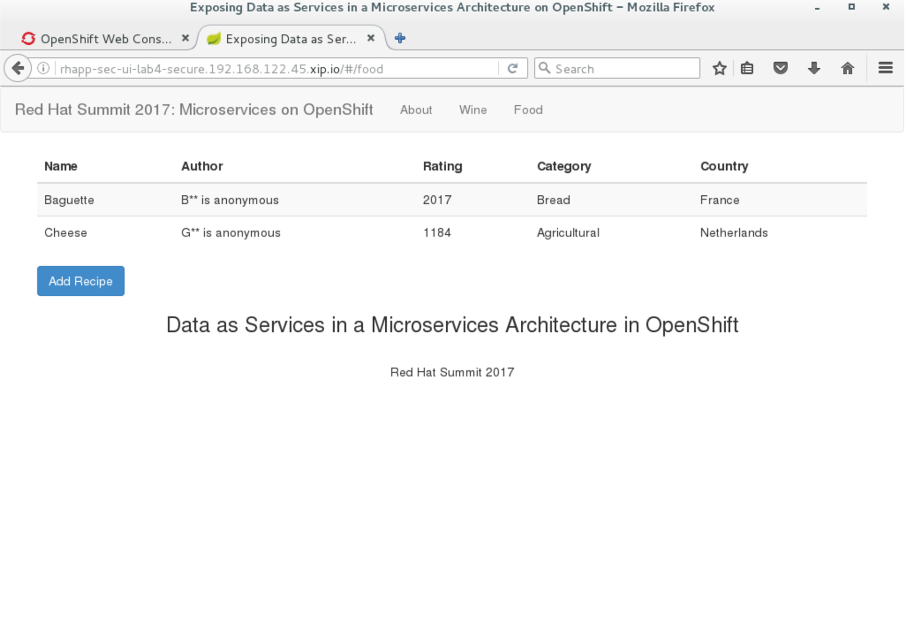

== Lab 4 part II - Changing the microservices application using data services with security

Data roles, also called entitlements, are sets of permissions defined per VDB that dictate data access (create, read, update, delete). Data roles use a fine-grained permission system that JDV will enforce at runtime and provide audit log entries for access violations.

Before applying Role Based Access Control (RBAC), note/consider the following:
A VDB deployed without any defined data roles is open for access to any authenticated user
Restrict source system access by modeling the VDB such that
Imported metadata is narrowed to what will be used (directly or indirectly) by the view models
At a more granular level, source table columns that will not be used or required are removed or the source table marked as non-updatable.

Let’s see this in action.

First we are going to create a new project called _lab4-secure_.

[source,bash]
----
[student@localhost ~]$ oc new-project lab4-secure
Now using project "lab4-secure" on server "https://192.168.122.45:8443".

You can add applications to this project with the 'new-app' command. For example, try:

	oc new-app centos/ruby-22-centos7~https://github.com/openshift/ruby-ex.git

to build a new example application in Ruby.
----

Check out directory ~/summit-2017-dataservices/labs/lab4_secure_ocp/templates.

[source,bash]
----
[student@localhost ~]$ cd ~/summit-2017-dataservices/labs/lab4_secure_ocp
----

In this directory you will find the OpenShift template containing the configuration needed to setup the complete lab4-secure environment. The template is exactly the same as in the lab4 environment. Take a look at food-vdb.xml and win-vdb.xml using a pre-installed code editor.

[source,bash]
----
[student@localhost lab4_secure_ocp]$ code vdb/secure-food-vdb.xml
[student@localhost lab4_secure_ocp]$ code vdb/secure-wine-vdb.xml
----

Compare secure-food-vdb.xml and secure-wine-vdb.xml against the ones we were using during lab4 and see the differences. In example:

[source,bash]
----
[student@localhost lab4_secure_ocp]$ code -d vdb/secure-wine-vdb.xml ~/summit-2017-dataservices/labs/lab4_ocp/vdb/wine-vdb.xml
[student@localhost lab4_secure_ocp]$ code -d vdb/secure-food-vdb.xml ~/summit-2017-dataservices/labs/lab4_ocp/vdb/food-vdb.xml
----

Note the differences, especially in the data-role section. ;)
Setup environment based on pre-built OpenShift template
Files for runtime artifacts are passed to the JDV for OpenShift image using the OpenShift secret mechanism. This includes the environment files for the data sources and resource adapters, as well as any additional data files. These files need to be present locally so we have to create secrets for them.

[source,bash]
----
[student@localhost lab4_secure_ocp]$ oc create -f extensions/datavirt-app-secret.yaml
[student@localhost lab4_secure_ocp]$ oc secrets new datavirt-app-config extensions/datasources.properties
[student@localhost lab4_ocp]$ oc adm policy add-role-to-user view system:serviceaccount:lab4-secure:datavirt-service-account
----

If you have a JSON or YAML file that defines a template, for example in our case we are using lab4-secure-template.json, you can upload the template to projects using the CLI. This saves the template to the project for repeated use by any user with appropriate access to that project. See for more instructions on writing your own templates. Furthermore you can use the CLI to process templates and use the configuration that is generated to create objects as shown below.

[source,bash]
----
[student@localhost lab4_ocp]$ oc process -f templates/lab4-secure-template.json | oc create -f -
buildconfig "rhapp-sec-food-service" created
buildconfig "rhapp-sec-jdv" created
buildconfig "rhapp-sec-jdv-ext" created
buildconfig "rhapp-sec-ui" created
buildconfig "rhapp-sec-wine-service" created
imagestream "rhapp-sec-food-service" created
imagestream "rhapp-sec-jdv" created
imagestream "rhapp-sec-jdv-ext" created
imagestream "rhapp-sec-ui" created
imagestream "rhapp-sec-wine-service" created
deploymentconfig "rhapp-sec-food-service" created
deploymentconfig "rhapp-sec-jdv" created
deploymentconfig "rhapp-sec-postgresql" created
deploymentconfig "rhapp-sec-ui" created
deploymentconfig "rhapp-sec-wine-service" created
route "jdbc-rhapp-sec-jdv" created
route "secure-rhapp-sec-jdv" created
route "rhapp-sec-jdv" created
route "rhapp-sec-ui" created
service "rhapp-sec-food-service" created
service "rhapp-sec-jdv" created
service "rhapp-sec-postgresql" created
service "rhapp-sec-ui" created
service "rhapp-sec-wine-service" created
----


Get all available build configs

[source,bash]
----
[student@localhost lab4_ocp]$ oc get bc
NAME                     TYPE      FROM      LATEST
rhapp-sec-food-service   Source    Binary    0
rhapp-sec-jdv            Source    Binary    0
rhapp-sec-jdv-ext        Docker    Binary    1
rhapp-sec-ui             Source    Binary    0
rhapp-sec-wine-service   Source    Binary    0
----

Now start the binary builds using the following commands:

[source,bash]
----
[student@localhost lab4_secure_ocp]$ oc start-build rhapp-sec-jdv-ext --from-dir=extensions
Uploading directory "extensions" as binary input for the build ...
build "rhapp-sec-jdv-ext-2" started
----

Go to the OpenShift Web console and navigate to the Builds→Builds page. Make sure the build rhapp-secure-jdv-ext is completed and proceed with the next step.

[source,bash]
----
[student@localhost lab4_secure_ocp]$ oc start-build rhapp-sec-jdv --from-dir=vdb
Uploading directory "vdb" as binary input for the build ...
build "rhapp-sec-jdv-2" started

[student@localhost lab4_secure_ocp]$ cd ~/summit-2017-dataservices/labs/lab4/projects

[student@localhost projects]$ oc start-build rhapp-sec-food-service --from-dir=food-service/deployments
Uploading directory "food-service/deployments" as binary input for the build ...
build "rhapp-sec-food-service-1" started

[student@localhost projects]$ oc start-build rhapp-sec-wine-service --from-dir=wine-service/deployments
Uploading directory "wine-service/deployments" as binary input for the build ...
build "rhapp-sec-wine-service-1" started

[student@localhost projects]$ oc start-build rhapp-sec-ui --from-dir=ui-service/deployments
Uploading directory "ui-service/deployments" as binary input for the build ...
build "rhapp-sec-ui-1" started
----

Now the containers will be built and deployed. Let’s see how our web application and in particular the wine and food data looks like when clicking on Wine and Food menu options.

Do you see any difference in the wine/food data compared to  the previous lab 4 without security?  
Explain why…. 

TIP: check secure-wine-vdb.xml and secure-food-vdb.xml again.

Cleanup lab4_secure

Delete project using OpenShift CLI

[source,bash]
----
[student@localhost projects]$ oc delete project lab4-secure
----

Remove the docker images
To remove the created docker images during this lab you can do 

[source,bash]
----
[student@localhost projects]$ docker images | grep rhapp-sec
REPOSITORY                                                                 	TAG             	IMAGE ID        	CREATED         	SIZE
172.30.1.1:5000/lab4-secure/rhapp-sec-wine-service                           latest              6b3908837766        About an hour ago   884.7 MB
172.30.1.1:5000/lab4-secure/rhapp-sec-food-service                           latest              0a774c1c21ed        About an hour ago   889.6 MB
172.30.1.1:5000/lab4-secure/rhapp-sec-ui                                     latest              09ec00b02d1c        About an hour ago   775.6 MB
172.30.1.1:5000/lab4-secure/rhapp-sec-jdv                                    latest              d0c414c5c4cf        About an hour ago   972.7 MB
172.30.1.1:5000/lab4-secure/rhapp-sec-jdv                                    <none>              1f9933bb9eb8        About an hour ago   972.7 MB
172.30.1.1:5000/lab4-secure/rhapp-sec-jdv-ext                                latest              ff5776835b2b        About an hour ago   972.7 MB
----

You can remove the image one by one using:

[source,bash]
----
[student@localhost projects]$ docker rmi <image id>
----

For you convenience we have a script called rmlab4secure available which removes all images with rhapp in the name:

[source,bash]
----
[student@localhost projects]$ rmlab4secure
----

Congratulations, you’ve finished all labs!!!!! 

In this year’s Summit lab you have learnt how to expose data as services in a microservice architecture using Red Hat JBoss Data Virtualization running on Red Hat OpenShift Container Platform. Got exited, see below for a list of useful resource to get even more excited. Enjoy your further stay at Red Hat Summit 2017. 