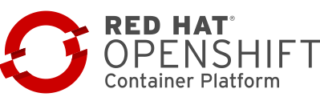
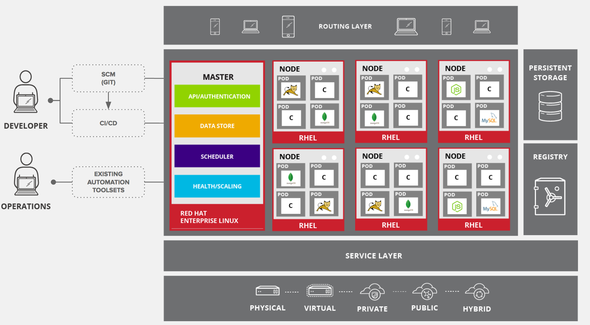
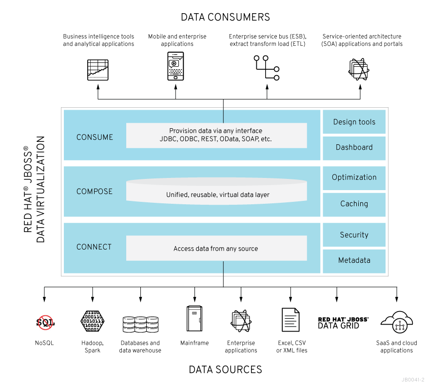
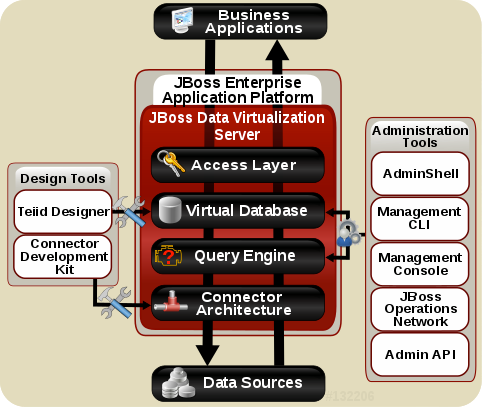

== Introduction

Before we jump into the demo and see how OpenShift can support a polyglot microservice system based on many different services, let’s spend some time talking about the architecture of the demo application and the components the demo is using. 

=== Red Hat OpenShift Container Platform

Red Hat OpenShift Container Platform (OCP) v3 is a layered system designed to expose underlying Docker-formatted container image and Kubernetes concepts as accurately as possible, with a focus on easy composition of applications by a developer. For example, install Ruby, push code, and add MySQL.

The concept of an application as a separate object is removed in favor of more flexible composition of "services", allowing two web containers to reuse a database or expose a database directly to the edge of the network.

The Docker service provides the abstraction for packaging and creating Linux-based, lightweight container images. Kubernetes provides the cluster management and orchestrates containers on multiple hosts.
OCP adds:

* Source code management, builds, and deployments for developers
* Managing and promoting images at scale as they flow through your system
* Application management at scale
* Team and user tracking for organizing a large developer organization

The following topics provide high-level, architectural information on core concepts and objects you will encounter when using OCP. Many of these objects come from Kubernetes, which is extended by OCP to provide a more feature-rich development lifecycle platform.

* https://docs.openshift.com/container-platform/3.5/architecture/core_concepts/containers_and_images.html#architecture-core-concepts-containers-and-images[Containers and images] are the building blocks for deploying your applications.
* https://docs.openshift.com/container-platform/3.5/architecture/core_concepts/pods_and_services.html#architecture-core-concepts-pods-and-services[Pods and services] allow for containers to communicate with each other and proxy connections.
* https://docs.openshift.com/container-platform/3.5/architecture/core_concepts/projects_and_users.html#architecture-core-concepts-projects-and-users[Projects and users] provide the space and means for communities to organize and manage their content together.
* https://docs.openshift.com/container-platform/3.5/architecture/core_concepts/builds_and_image_streams.html#architecture-core-concepts-builds-and-image-streams[Builds and image streams] allow you to build working images and react to new images.
* https://docs.openshift.com/container-platform/3.5/architecture/core_concepts/deployments.html#architecture-core-concepts-deployments[Deployments] add expanded support for the software development and deployment lifecycle.
* https://docs.openshift.com/container-platform/3.5/architecture/core_concepts/routes.html#architecture-core-concepts-routes[Routes] announce your service to the world.
* https://docs.openshift.com/container-platform/3.5/architecture/core_concepts/templates.html#architecture-core-concepts-templates[Templates] allow for many objects to be created at once based on customized parameters.

What Is the Red Hat OpenShift Container Platform (OCP) Architecture?

OCP has a microservices-based architecture of smaller, decoupled units that work together. It can run on top of (or alongside) a https://docs.openshift.com/container-platform/3.5/architecture/infrastructure_components/kubernetes_infrastructure.html#architecture-infrastructure-components-kubernetes-infrastructure[Kubernetes cluster], with data about the objects stored in https://docs.openshift.com/container-platform/3.5/architecture/infrastructure_components/kubernetes_infrastructure.html#master[etcd], a reliable clustered key-value store. 

The figure below depicts the architectural overview of Red Hat OpenShift Container Platform:

Those services are broken down by function:

* https://docs.openshift.com/container-platform/3.5/rest_api/index.html#rest-api-index[REST APIs], which expose each of the https://docs.openshift.com/container-platform/3.5/architecture/core_concepts/index.html#architecture-core-concepts-index[core objects].
* Controllers, which read those APIs, apply changes to other objects, and report status or write back to the object.

Users make calls to the REST API to change the state of the system. Controllers use the REST API to read the user’s desired state, and then try to bring the other parts of the system into sync. For example, when a user requests a https://docs.openshift.com/container-platform/3.5/architecture/core_concepts/builds_and_image_streams.html#builds[build] they create a "build" object. The build controller sees that a new build has been created, and runs a process on the cluster to perform that build. When the build completes, the controller updates the build object via the REST API and the user sees that their build is complete.

The controller pattern means that much of the functionality in OCP is extensible. The way that builds are run and launched can be customized independently of how images are managed, or how https://docs.openshift.com/container-platform/3.5/architecture/core_concepts/deployments.html#architecture-core-concepts-deployments[deployments] happen. The controllers are performing the "business logic" of the system, taking user actions and transforming them into reality. By customizing those controllers or replacing them with your own logic, different behaviors can be implemented. From a system administration perspective, this also means the API can be used to script common administrative actions on a repeating schedule. Those scripts are also controllers that watch for changes and take action. OCP makes the ability to customize the cluster in this way a first-class behavior.

To make this possible, controllers leverage a reliable stream of changes to the system to sync their view of the system with what users are doing. This event stream pushes changes from etcd to the REST API and then to the controllers as soon as changes occur, so changes can ripple out through the system very quickly and efficiently. However, since failures can occur at any time, the controllers must also be able to get the latest state of the system at startup, and confirm that everything is in the right state. This resynchronization is important, because it means that even if something goes wrong, then the operator can restart the affected components, and the system double checks everything before continuing. The system should eventually converge to the user’s intent, since the controllers can always bring the system into sync.

=== Red Hat JBoss Data Virtualization

Red Hat JBoss Data Virtualization (JDV) is a complete data provisioning, federation, integration and management solution that enables organizations to gain actionable and unified information. Red Hat JBoss Data Virtualization enables agile data utilization in three steps:

. *Connect*: Access data from multiple, heterogeneous data sources.
. *Compose*: Create reusable, business-friendly logical data models and views by combining and transforming data.
. *Consume*: Make unified data easily consumable through open standard interfaces.

JDV includes:

* Tools for creating data views that are accessible through standard protocols. For those who are already familiar with JDV one of the tools is the Teiid Designer plug-in for Red Hat JBoss Developer Studio (JBDS).
* A robust runtime environment that provides enterprise-class performance, data integrity, and security (the JDV Server, which executes as a process within the Red Hat JBoss Enterprise Application Platform (EAP)).
* A repository for storing metadata (ModeShape)

JDV is based on the following community projects:

* Teiid (http://www.jboss.org/teiid)
* Teiid Designer (http://www.jboss.org/teiiddesigner)
* ModeShape (http://www.jboss.org/modeshape)

The figure below depicts the architectural overview of JDV:

[cols="2"] 
|===
|*JDV Components*
|*Description*

|Query Engine
|The heart of JDV Server is a high-performance query engine that processes relational, XML, XQuery and procedural queries from federated data sources. Features include support for homogeneous schemas, heterogeneous schemas, transactions, and user defined

|Embedded
|An easy-to-use JDBC Driver that can embed the Query Engine in any Java application.

|Server
|An enterprise ready, scalable, manageable, runtime for the Query Engine that runs inside JBoss EAP that provides additional security, fault-tolerance, and administrative features.

|Connectors
|JDV Server includes a rich set of Translators and Resource Adapters that enable access to a variety of sources, including most relational databases, web services, text files, and ldap.
Need data from a different source? Custom translators and resource adaptors can easily be developed.

|Tools
|JDV Server includes development and administration tools to
* Create - Use Teiid Designer to define virtual databases containing views, procedures or even dynamic XML documents.
* Monitor & Manage - Use the Management Console with JBoss EAP or use the JDV JBoss Operations Network (JON) plugin to control any number of servers.
* Script - Use the AdminShell to automate administrative and testing tasks.

|===

The Red Hat JBoss Data Virtualization for OpenShift image is based on Red Hat JBoss Data Virtualization 6.3. In addition, the JDV for OpenShift image is built on the EAP for OpenShift image. As a result, the same differences exist for the JDV for OpenShift image. To get started with the JDV for OpenShift image please check out https://access.redhat.com/documentation/en/red-hat-xpaas/0/paged/red-hat-xpaas-jdv-for-openshift-image/chapter-3-get-started